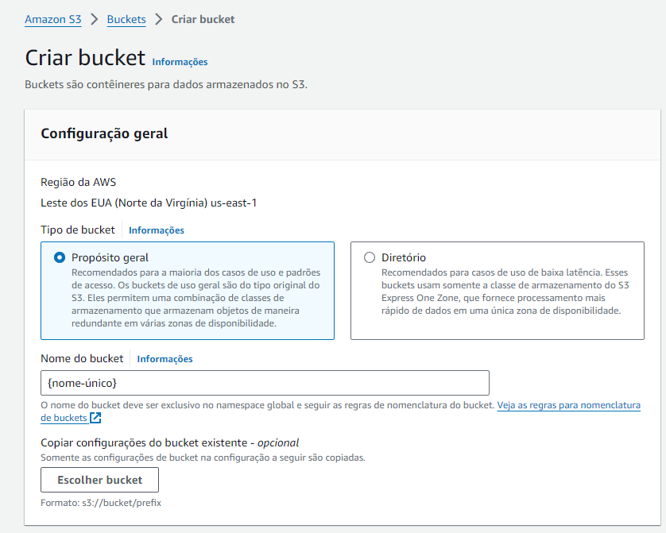
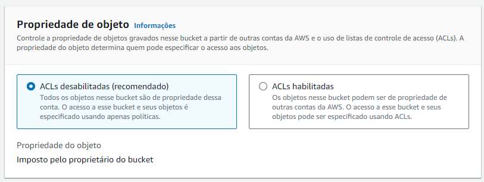
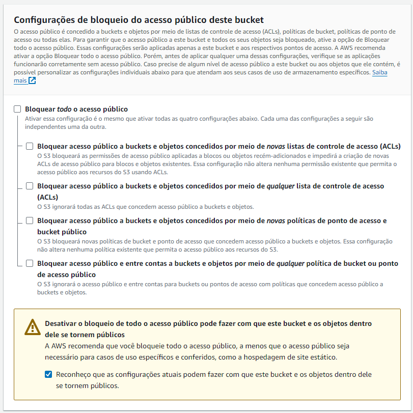
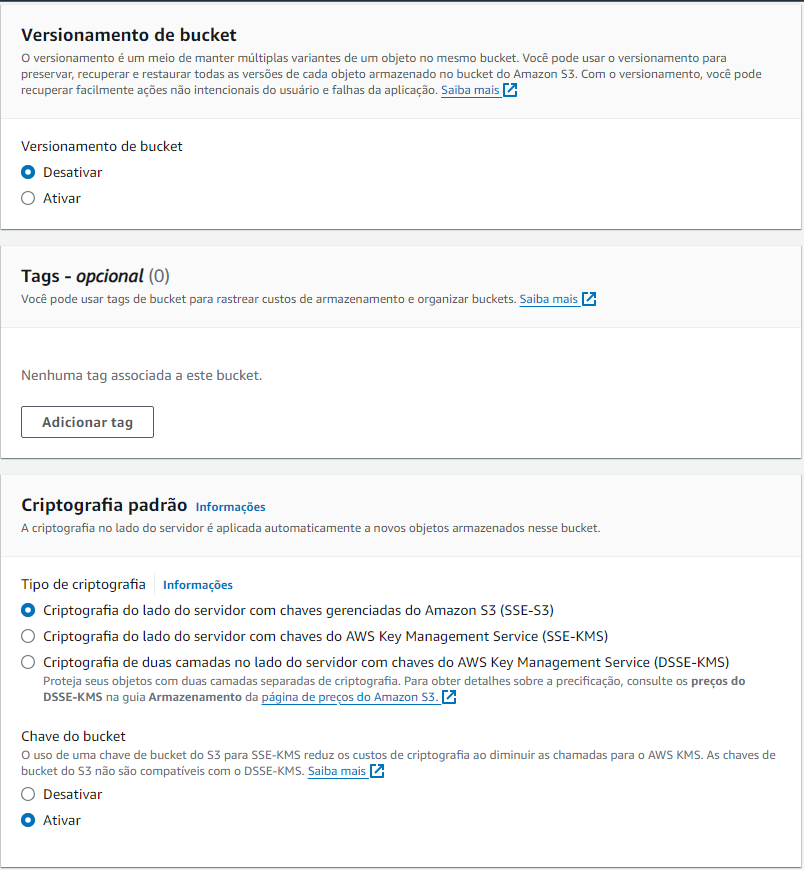
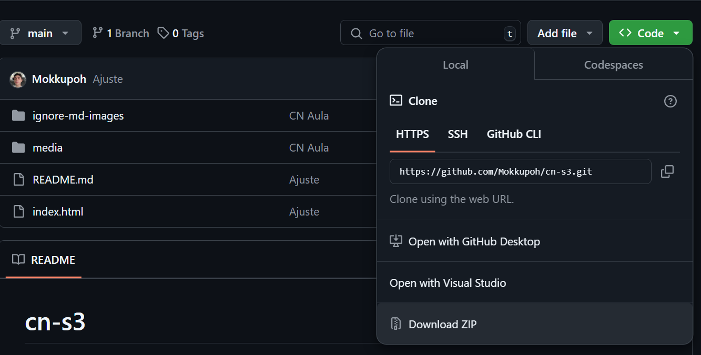
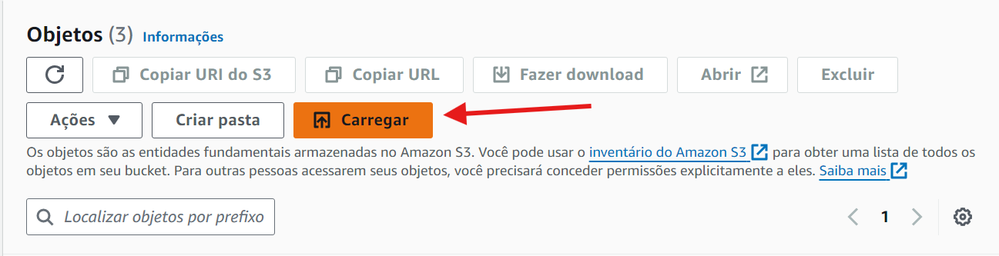
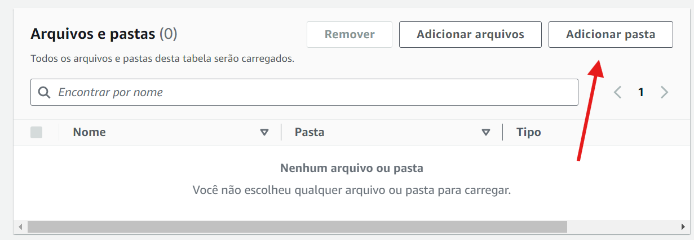

# cn-s3
## Guia de Criação de um Bucket
Observações:
* O nome do bucket é único, priorize nomes pequenos para maior facilidade no momento em que for acessar os arquivos do bucket publicamente.



* ACLs habilitadas permitem um compartilhamento de bucket em diferentes contas da AWS(Academy não é permitido)



* É necessário que as configurações de bloqueio estejam todas desmarcadas com o intuito de permitir acesso aos itens(em URL pública) que vamos efetuar o upload posteriormente.



* Aqui não mexemos em nada, apenas o padrão da AWS.



## Upando arquivos para o Amazon S3

* Baixe os arquivos do repositório e extraia em algum local do seu computador.



* Na aba Objetos clique em "Carregar"



* Adicionar pasta e selecione a pasta que estão os arquivos do repositório



## Como permitir que os arquivos seja acessados pela URL pública

No menu de permissões vamos editar a política de bucket existente, na política vamos copiar e colar o JSON abaixo(lembre de alterar o nome do bucket):

```json
{
    "Version": "2012-10-17",
    "Statement": [
        {
            "Effect": "Allow",
            "Principal": "*",
            "Action": [
                "s3:ListBucket",
                "s3:GetObject"
            ],
            "Resource": [
                "arn:aws:s3:::meu-bucket-exemplo",
                "arn:aws:s3:::meu-bucket-exemplo/*"
            ]
        }
    ]
}
```
Colado o JSON agora vamos salvar a nova política em "Salvar alterações"

## Link padrão para buckets da AWS
```
https://<nome-do-seu-bucket>.s3.<região>.amazonaws.com/<nome-do-arquivo>
```
Exemplo:
```
https://cn-aula-1.s3.us-east-1.amazonaws.com/cn-s3/image.png

https://cn-aula-1.s3.us-east-1.amazonaws.com/cn-s3/index.html
```

## Alguns outros exemplos de políticas

>### 1. Permitir upload de objetos (escrita) no bucket:
* s3:PutObject: Permite que arquivos sejam enviados para o bucket, mas não que sejam lidos ou excluídos.
```json
{
    "Version": "2012-10-17",
    "Statement": [
        {
            "Effect": "Allow",
            "Principal": "*",
            "Action": "s3:PutObject",
            "Resource": "arn:aws:s3:::meu-bucket-exemplo/*"
        }
    ]
}
```
>### Restringir o acesso por IP (Whitelist de IP):
* Essa política permite que apenas solicitações de um endereço IP específico possam acessar os objetos do bucket:
```json
{
    "Version": "2012-10-17",
    "Statement": [
        {
            "Effect": "Allow",
            "Principal": "*",
            "Action": "s3:GetObject",
            "Resource": "arn:aws:s3:::meu-bucket-exemplo/*",
            "Condition": {
                "IpAddress": {
                    "aws:SourceIp": "192.168.1.1/32"
                }
            }
        }
    ]
}
```

>### Permitir acesso a um bucket específico para um usuário IAM:
* Aqui está uma política que permite que um usuário específico tenha permissão de leitura e escrita no bucket, mas nenhum outro acesso.

```json
{
    "Version": "2012-10-17",
    "Statement": [
        {
            "Effect": "Allow",
            "Principal": {
                "AWS": "arn:aws:iam::123456789012:user/meu-usuario"
            },
            "Action": [
                "s3:GetObject",
                "s3:PutObject"
            ],
            "Resource": "arn:aws:s3:::meu-bucket-exemplo/*"
        }
    ]
}
```

## Obrigado pela leitura!